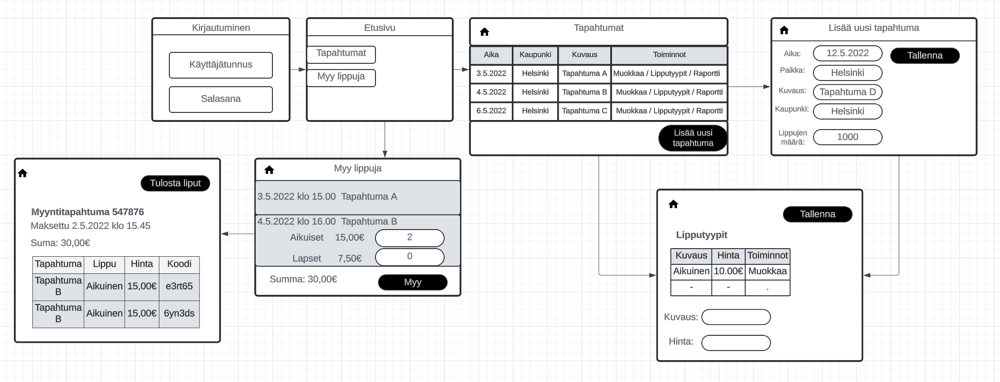
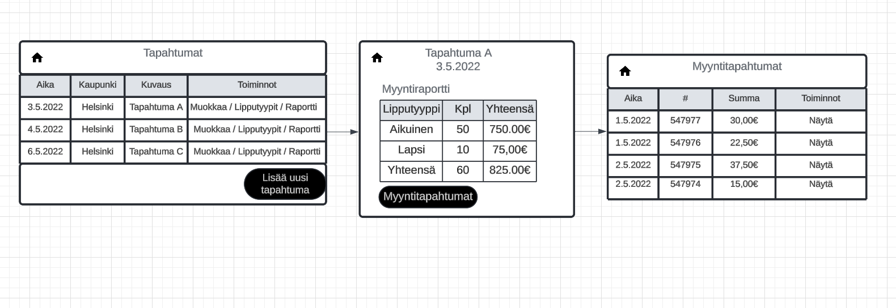
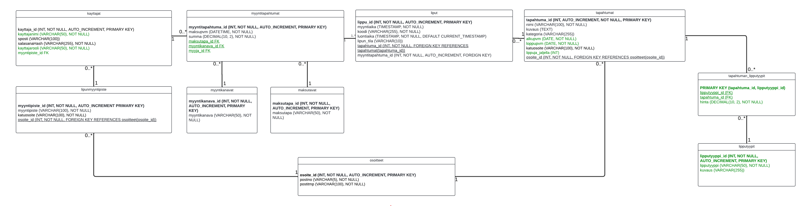

# Lipunmyyntijärjestelmä

Tiimi: Jere Holopainen, Miikka Vartiainen, Jami Norja, Eemil Airaksinen, Anton Asikainen

## Johdanto

**TicketGuru** on lipunmyyntijärjestelmä, joka on suunniteltu lipputoimiston käyttöön. Järjestelmä mahdollistaa lippujen myymisen, hallinnan ja tulostamisen myyntipisteessä, sekä lipputarkistuksen tapahtumapaikalla. Tulevaisuudessa järjestelmään voidaan lisätä verkkokauppa, joka mahdollistaa lipun ostamisen verkossa.

### Toteutus- ja toimintaympäristö
- **Palvelinpuolen ratkaisut ja teknologiat:**
    - Palvelinpuoli toteutetaan **Spring Boot** -kehystä käyttäen
    - **Tietokannan suunnittelu UML-Kaaviota käyttäen**
    - **REST API** *
    - **Rajapinta ja olioiden väliset yhteydet JPA:ta käyttäen**
    - **Vastauskoodit ja virhetilanteiden käsittely** *
    - **Autentikointi ja auktorisointi** *
    - **Tietokanta MySQL:n avulla ja julkaisu** *

- **Käyttöliittymäratkaisut ja teknologiat:**
    - Järjestelmä suunnitellaan **desktop-laitteille**, mutta se on responsiivinen, jolloin se toimii myös tabletilla ja mobiililaitteilla. 
    - **Web-ohjelmointi ReactJS-kirjastoa apuna käyttäen**
    
`NOTE: [tähdellä (*) merkittyjen kohtien tarkemmat tiedot lisätään kurssin edetessä.]`

### Projektin lopputulos

Lopputuloksena on käyttövalmis TicketGuru-järjestelmä lipputoimistolle, joka sisältää tapahtumien hallinnan, lippujen myynnin ja tulostamisen sekä lipputarkastuksen. Järjestelmä on myös valmis laajentumaan verkkokaupaksi.

---

## Järjestelmän määrittely

TicketGuru-järjestelmässä on useita selkeitä keskeisiä käyttäjärooleja. 
Näistä rooleista on muodostettu käyttäjätarinoita, joiden avulla pystytään syventymään roolien tarpeisiin ja järjestelmän tavoitteisiin.

1. **Lipunmyyjä**
- Myy ja tulostaa liput. Tarkastaa liput ovella ja merkitsee ne käytetyiksi järjestelmään lipussa olevalla koodilla.

    >*Käyttäjätarinat:*
    > - Lipunmyyjänä haluan myydä lippuja asiakkaille ja tulostaa ne järjestelmästä, jotta asiakas saa lipun heti mukaansa paikan päälle.
    >>
    > - Lipunmyyjänä haluan merkitä tarkastetut liput käytetyiksi järjestelmässä, jotta samaa lippua ei voida käyttää uudelleen ja estää väärinkäytökset.
    >> 
    > - Lipunmyyjänä haluan pystyä muuttamaan lipun tietoja, jotta voin vastata sujuvasti asiakkaan muutospyyntöihin.
    >>
    > - Lipunmyyjänä haluan voida peruuttaa asiakkaan lipun ja tekemään hyvityksen, jotta asiakkaan asiakaskokemus säilyy korkeana.

2. **Asiakas**
- Ostaa lippuja paikan päältä, jatkossa myös verkkokaupasta. Paikan päällä saa itselleen tulostetun lipun, verkkokaupasta tilattuna sähköpostitse.

    >*Käyttäjätarinat:*
    > - Asiakkaana haluan ostaa lipun paikan päältä lipunmyyntipisteeltä, jotta voin osallistua haluamaani tapahtumaan heti.
    >>
    > - Asiakkaana haluan saada verkkokaupasta ostetun lipun sähköpostiini, jotta voin tallentaa sen sähköisesti ja esittää sen tapahtuman ovella puhelimesta.
     >>
    > - Asiakkaana haluan pystyä perumaan lippuni ja saada hyvityksen, jotta voin muuttaa suunnitelmiani tarvittaessa.

3. **Järjestelmän ylläpitäjä**
- Vastaa järjestelmän teknisestä ylläpidosta. Toimii myös teknisenä tukena.

    >*Käyttäjätarinat:*
    > - Järjestelmän ylläpitäjänä haluan ylläpitää järjestelmän teknisiä toimintoja, jotta TicketGuru toimii luotettavasti ja tehokkaasti kaikille käyttäjille.
    >>
    > - Järjestelmän ylläpitäjänä haluan tarjota teknistä tukea järjestelmän käyttäjille, jotta voin ratkaista mahdolliset ongelmat nopeasti ja minimoida käyttökatkokset.

4. **Tapahtumien ylläpitäjä**
- Vastaa tapahtumien lisäämisestä, poistamisesta ja muokkaamisesta järjestelmässä. Voi tulostaa myös erilaisia raportteja lippuihin ja niiden myyntiin liittyen.

    >*Käyttäjätarinat:*
    > - Tapahtumien ylläpitäjänä haluan lisätä uusia tapahtumia järjestelmään, jotta lipunmyynti voi alkaa ajoissa ja asiakkaat voivat ostaa lippuja.
    >>
    > - Tapahtumien ylläpitäjänä haluan muokata olemassa olevien tapahtumien tietoja, jotta voin päivittää esimerkiksi tapahtuma-ajan tai -paikan muutokset.
    >>
    > - Tapahtumien ylläpitäjänä haluan poistaa peruutetut tapahtumat järjestelmästä, jotta virheelliset tapahtumat eivät ole näkyvissä asiakkaille ja vältetään sekaannukset.
    >>
    > - Tapahtumien ylläpitäjänä haluan tuottaa järjestelmään tallennetun datan perusteella raportteja lipunmyynnistä, jotta voin parantaa myyntiä tulevaisuudessa.

## Käyttöliittymä
- Käyttöliittymäkaavio

- Tapahtumasivulta siirtyminen tapahtumien raportteihin ja myyntitapahtumiin

## Tietokanta
- TicketGuru-tietokannan UML-luokkakaavio

> Linkki UML-luokkakaavion sivuille:
> https://lucid.app/lucidchart/cc73c021-a71b-40e2-b45e-cc985ebd1832/edit?viewport_loc=-2463%2C-161%2C2984%2C1477%2CHWEp-vi-RSFO&invitationId=inv_80605f74-82a3-4fa1-99c2-f3d2ad5d97b4

Lisäksi kukin järjestelmän tietoelementti ja sen attribuutit kuvataan
tietohakemistossa. Tietohakemisto tarkoittaa yksinkertaisesti vain jokaisen elementin (taulun) ja niiden
attribuuttien (kentät/sarakkeet) listausta ja lyhyttä kuvausta esim. tähän tyyliin:

> ### _Tilit_
> _Tilit-taulu sisältää käyttäjätilit. Käyttäjällä voi olla monta tiliä. Tili kuuluu aina vain yhdelle käyttäjälle._
>
> Kenttä | Tyyppi | Kuvaus
> ------ | ------ | ------
> id | int PK | Tilin id
> nimimerkki | varchar(30) |  Tilin nimimerkki
> avatar | int FK | Tilin avatar, viittaus [avatar](#Avatar)-tauluun
> kayttaja | int FK | Viittaus käyttäjään [käyttäjä](#Kayttaja)-taulussa

## Tekninen kuvaus

Teknisessä kuvauksessa esitetään järjestelmän toteutuksen suunnittelussa tehdyt tekniset
ratkaisut, esim.

-   Missä mikäkin järjestelmän komponentti ajetaan (tietokone, palvelinohjelma)
    ja komponenttien väliset yhteydet (vaikkapa tähän tyyliin:
    https://security.ufl.edu/it-workers/risk-assessment/creating-an-information-systemdata-flow-diagram/)
-   Palvelintoteutuksen yleiskuvaus: teknologiat, deployment-ratkaisut yms.
-   Keskeisten rajapintojen kuvaukset, esimerkit REST-rajapinta. Tarvittaessa voidaan rajapinnan käyttöä täsmentää
    UML-sekvenssikaavioilla.
-   Toteutuksen yleisiä ratkaisuja, esim. turvallisuus.

Tämän lisäksi

-   ohjelmakoodin tulee olla kommentoitua
-   luokkien, metodien ja muuttujien tulee olla kuvaavasti nimettyjä ja noudattaa
    johdonmukaisia nimeämiskäytäntöjä
-   ohjelmiston pitää olla organisoitu komponentteihin niin, että turhalta toistolta
    vältytään

## Testaus

Tässä kohdin selvitetään, miten ohjelmiston oikea toiminta varmistetaan
testaamalla projektin aikana: millaisia testauksia tehdään ja missä vaiheessa.
Testauksen tarkemmat sisällöt ja testisuoritusten tulosten raportit kirjataan
erillisiin dokumentteihin.

Tänne kirjataan myös lopuksi järjestelmän tunnetut ongelmat, joita ei ole korjattu.

## Asennustiedot

Järjestelmän asennus on syytä dokumentoida kahdesta näkökulmasta:

-   järjestelmän kehitysympäristö: miten järjestelmän kehitysympäristön saisi
    rakennettua johonkin toiseen koneeseen

-   järjestelmän asentaminen tuotantoympäristöön: miten järjestelmän saisi
    asennettua johonkin uuteen ympäristöön.

Asennusohjeesta tulisi ainakin käydä ilmi, miten käytettävä tietokanta ja
käyttäjät tulee ohjelmistoa asentaessa määritellä (käytettävä tietokanta,
käyttäjätunnus, salasana, tietokannan luonti yms.).

## Käynnistys- ja käyttöohje

Tyypillisesti tässä riittää kertoa ohjelman käynnistykseen tarvittava URL sekä
mahdolliset kirjautumiseen tarvittavat tunnukset. Jos järjestelmän
käynnistämiseen tai käyttöön liittyy joitain muita toimenpiteitä tai toimintajärjestykseen liittyviä asioita, nekin kerrotaan tässä yhteydessä.

Usko tai älä, tulet tarvitsemaan tätä itsekin, kun tauon jälkeen palaat
järjestelmän pariin !
